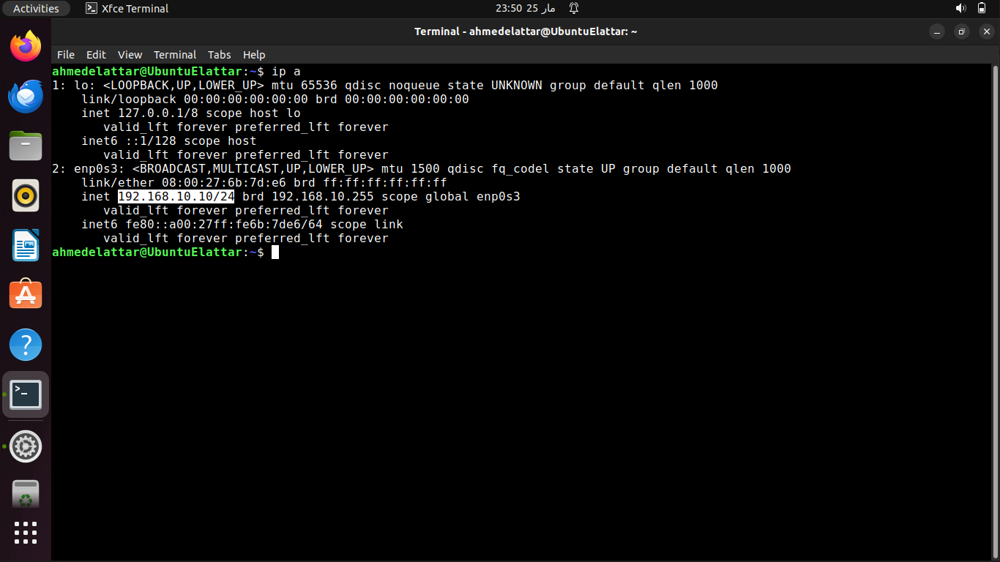
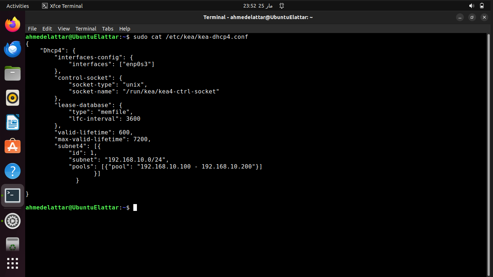
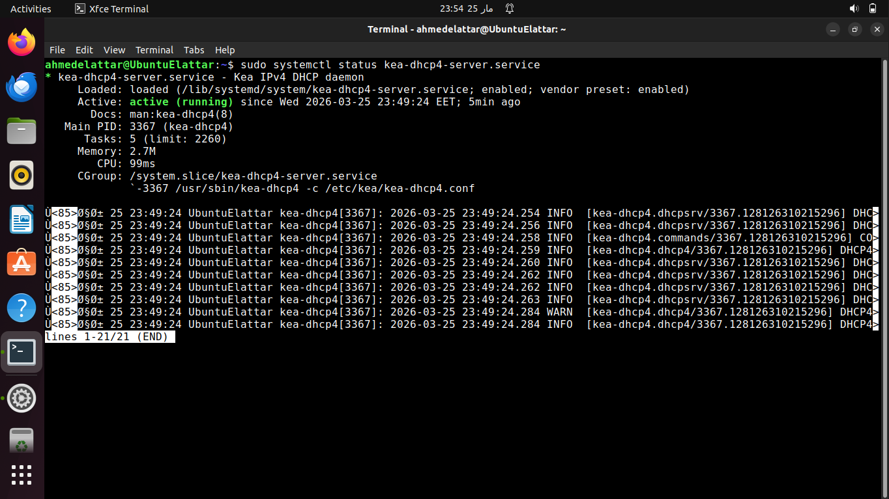
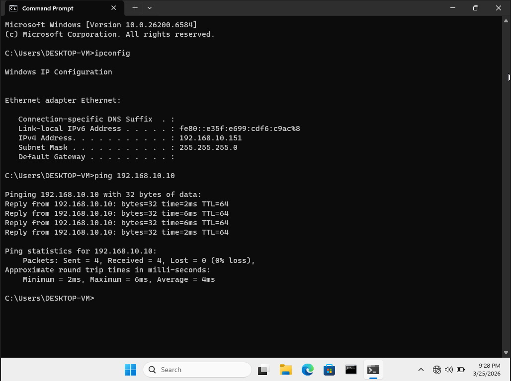

# Linux DHCP Server Lab (192.168.10.0/24)

---

## 1. Objective
Configure a DHCP server on a Linux machine to automatically assign IP addresses to client devices within a local network.

---

## 2. Lab Environment

- OS: Ubuntu 22.04  
- Client: Windows 11  
- Virtualization: VirtualBox  
- Network Type: Internal Network (Host-Only)

---

## 3. Network Design

- Network: 192.168.10.0/24  
- DHCP Server IP: 192.168.10.10  
- DHCP Range: 192.168.10.100 – 192.168.10.200  
- Subnet Mask: 255.255.255.0  
- Gateway: 192.168.10.1  

### Topology

[ DHCP Server ]
|
Internal Network
|
[ Client Machine ]


---

## 4. Concept Overview

DHCP (Dynamic Host Configuration Protocol) is used to automatically assign IP configuration to devices in a network.

Instead of manually configuring each device, DHCP dynamically provides:
- IP Address  
- Subnet Mask  
- Default Gateway  
- DNS Server  

### DORA Process
- Discover → Client broadcasts request  
- Offer → Server offers IP address  
- Request → Client accepts the offer  
- Acknowledge → Server confirms lease  

---

## 5. Implementation

### Step 1: Configure Static IP on Server

Check interface name:

```ip a```

Edit Netplan configuration:

```
sudo nano /etc/netplan/01-netcfg.yaml
```
File content:
```
network:
  version: 2
  renderer: networkd
  ethernets:
    ens33:
      dhcp4: no
      addresses:
        - 192.168.10.10/24
```
Apply changes:
```
sudo netplan apply
```

### Step 2: Install DHCP Server
```
sudo apt update
sudo apt install kea
```
### Step 3: Configure DHCP
```
sudo nano /etc/kea/kea-dhcp4.conf
```
Replace the config with this:
```
{
  "Dhcp4": {
    "interfaces-config": {
      "interfaces": [ "enp0s3" ]
    },

    "lease-database": {
      "type": "memfile",
      "persist": true,
      "name": "/var/lib/kea/kea-leases4.csv"
    },

    "subnet4": [
      {
        "subnet": "192.168.10.0/24",
        "pools": [
          {
            "pool": "192.168.1.100 - 192.168.1.200"
          }
        ]
      }
    ]
  }
}
```
### Step 4: Start Kea Service
```
sudo systemctl restart kea-dhcp4-server
sudo systemctl enable kea-dhcp4-server
```

### Step 5: Test on Windows Client:

Set IP configuration to automatic optain an IP.

Open the command prompt:
```
ipconfig /release
ipconfig /renew
```
---

## 6. Verification & Testing

Check assigned IP on client:
```
ipconfig
```
Expected range:

192.168.10.100 – 192.168.10.200

Test connectivity:
```
ping 192.168.10.10
```
Result:

Client successfully received IP address
Network communication confirmed

---

## 7. Issues & Troubleshooting

| Issue | Cause | Fix |
| ----- | ----- | ----- |
| Client not receiving IP | Incorrect network interface configured | Updated correct interface in DHCP configuration |
| DHCP service not starting | Configuration syntax error | Check the config file |

---

## 8. Screenshots

Server IP:




DHCP configuration file:



DHCP service status:



Client IP and Ping test results:



---

## 9. Key Takeaways

- DHCP simplifies network configuration and reduces manual errors
- Correct interface configuration is critical for service operation
- Understanding the DORA process improves troubleshooting ability
- Small configuration mistakes can prevent DHCP from functioning

---

## 10. Future Improvements

- Integrate DHCP with a DNS server
- Expand to multiple subnets
- Add monitoring and logging for DHCP leases
