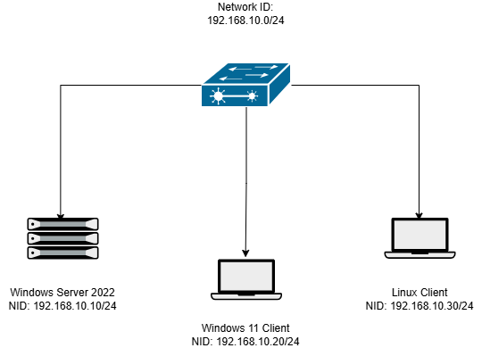

# LAN Connectivity Lab

## Overview
This lab demonstrates the creation of a small virtual Local Area Network (LAN) using virtual machines to practice basic networking configuration and connectivity testing.

## Lab Environment

Virtual Machines used in this lab:

• Windows Server 2022  
• Windows 11 Client  
• Ubuntu Linux Client  

All machines are connected to an internal virtual network.

## Network Addressing

Network ID: 192.168.10.0/24

| Device | IP Address |
|------|------|
| Windows Server | 192.168.10.10 |
| Windows Client | 192.168.10.20 |
| Linux Client | 192.168.10.30 |

Subnet Mask: 255.255.255.0

## Network Topology

## Configuration Steps

1. Created three virtual machines.
2. Connected them to the same internal network.
3. Assigned static IP addresses.
4. Verified connectivity between machines.

## Connectivity Testing

Connectivity between systems was verified using ICMP ping tests.

Example command:

ping 192.168.10.10

Successful responses confirmed proper LAN communication.

## Screenshots

Screenshots of the configuration and connectivity tests are included in the screenshots directory.

## Future Improvements

Planned additions to this lab:

• DHCP server configuration  
• DNS server configuration  
• Active Directory domain setup  
