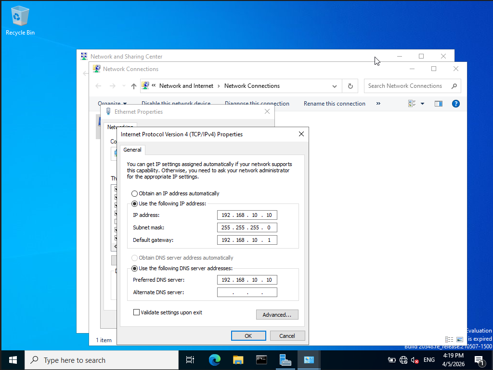
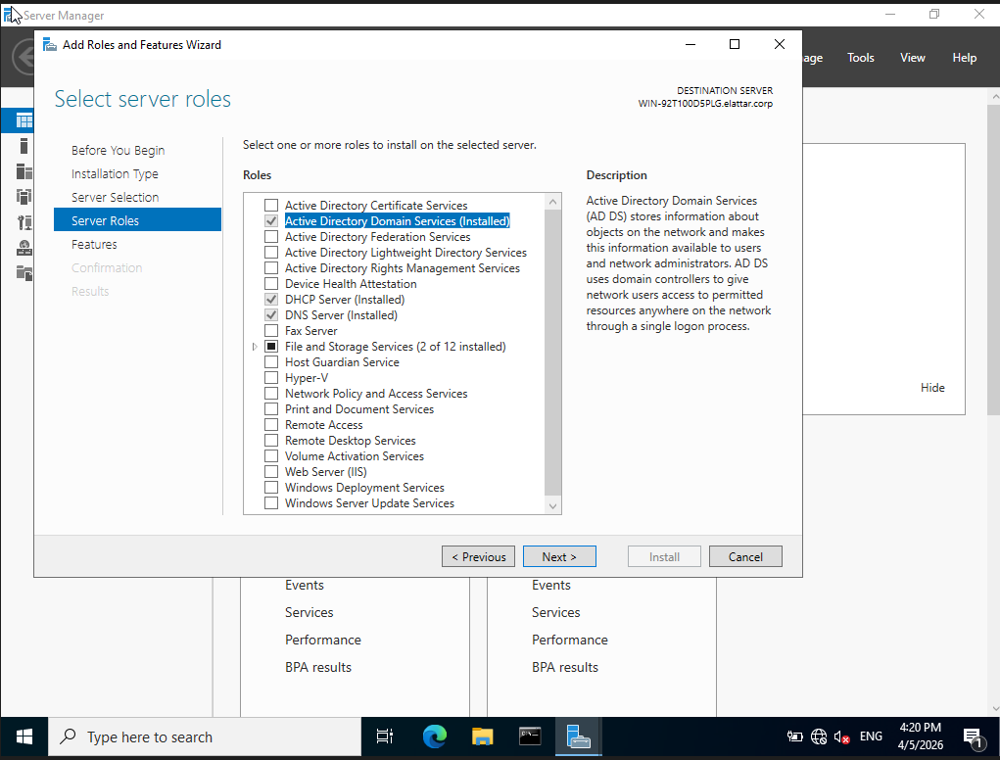
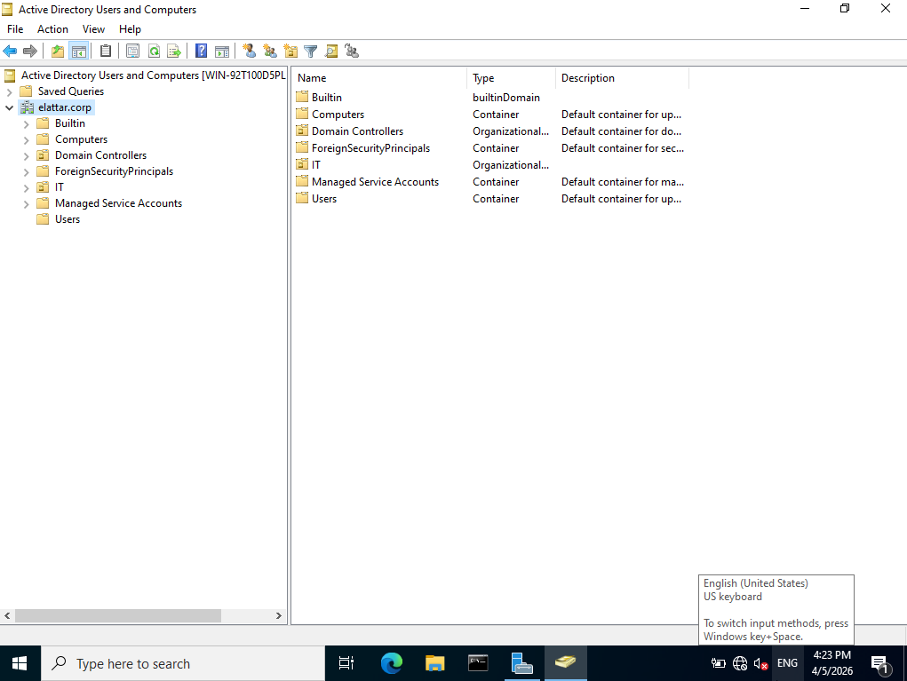

# Active Directory Domain Controller Lab

---

## 1. Objective
Set up a Windows Server as a Domain Controller using Active Directory Domain Services (AD DS) to create and manage a centralized network environment.

---

## 2. Lab Environment

- Server OS: Windows Server  
- Client OS: Windows 11  
- Virtualization: VirtualBox  
- Network Type: Internal Network (Host-Only)  

---

## 3. Network Design

- Network: 192.168.10.0/24  
- Domain Controller IP: 192.168.10.10  
- Client: DHCP / Static (same subnet)  

---

## 4. Concept Overview

- Active Directory (AD) is a directory service used to manage users, computers, and resources within a network.
- A Domain Controller (DC) is a server that handles:

    - Authentication (login)  
    - Authorization (permissions)  
    - Centralized management  
- Domains allow organizations to manage multiple machines from a single point.

---

## 5. Implementation

### Step 1: Set Static IP on Server

Ensure the server has a static IP:

- IP: 192.168.10.10
- Subnet: 255.255.255.0
- DNS: 192.168.10.10

---

### Step 2: Install Active Directory Domain Services (AD DS)

- Open Server Manager  
- Click "Add Roles and Features"  
- Select **Active Directory Domain Services**  
- Complete installation  

---

### Step 3: Promote Server to Domain Controller

- Click “Promote this server to a domain controller”  
- Select **Add a new forest**  
- Domain name: ahmed.local
- Set Directory Services Restore Mode (DSRM) password  
- Complete installation and restart  

---

### Step 4: Verify Domain Setup

After restart:

- Log in using domain credentials  
- Open:
  - Active Directory Users and Computers  
  - Verify domain is created  

---

## 6. Verification & Testing

- Domain successfully created  
- Server promoted to Domain Controller  
- Active Directory tools accessible  

---

## 7. Issues & Troubleshooting

| No. | Issue | Cause | Fix |
| --- | --- | --- | --- |
| 1 | Promotion failed | Incorrect network or DNS configuration | Ensure server uses its own IP as DNS | 
| 2 | Cannot log into domain | Domain not properly configured | Verify domain creation and restart services | 

---

## 8. Screenshots

Server IP configuration:

AD DS installation screen: 

Active Directory Users and Computers:

---

## 9. Key Takeaways

- Active Directory enables centralized management of users and systems  
- Domain Controllers are critical in enterprise environments  
- Proper DNS configuration is essential for AD functionality  
- AD simplifies authentication and access control  

---

## 10. Future Improvements

- Integrate DNS configuration
- Join client machines to domain  
- Create users and apply Group Policy  
---
