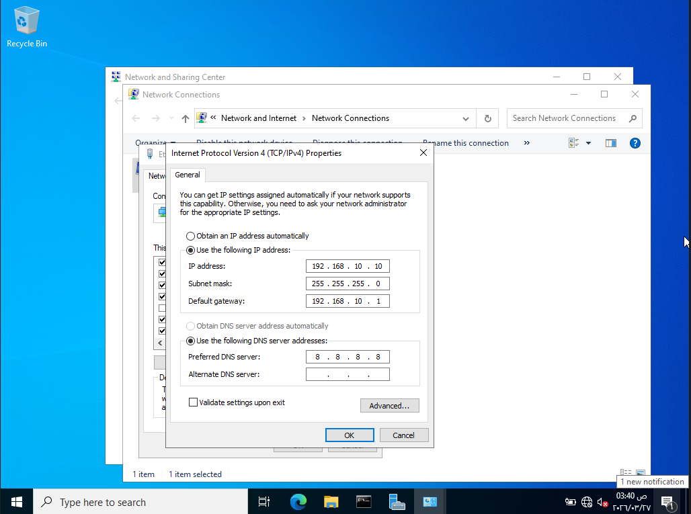
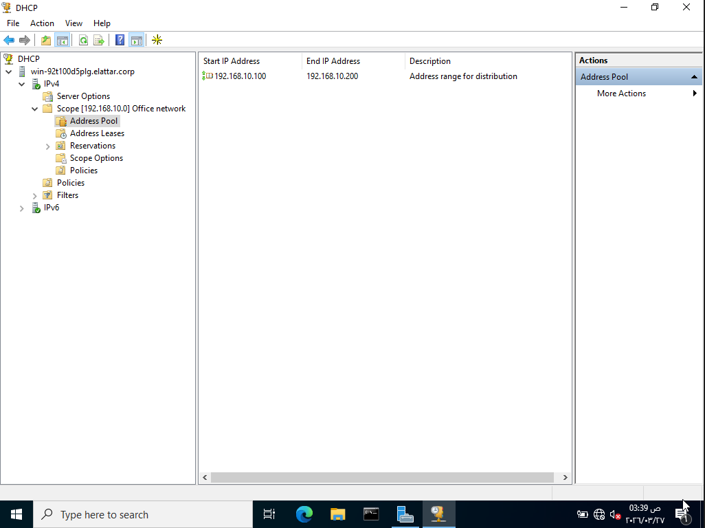
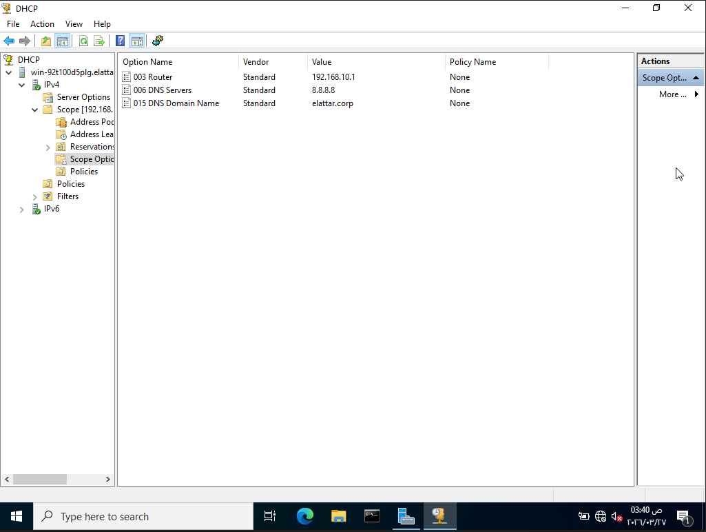
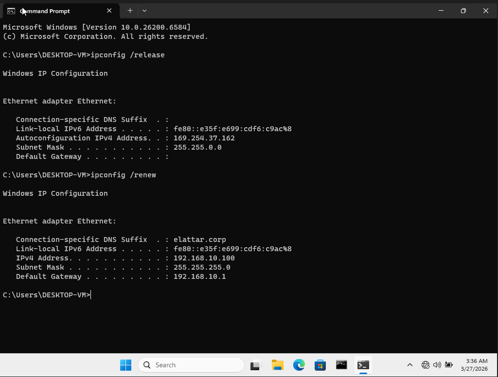
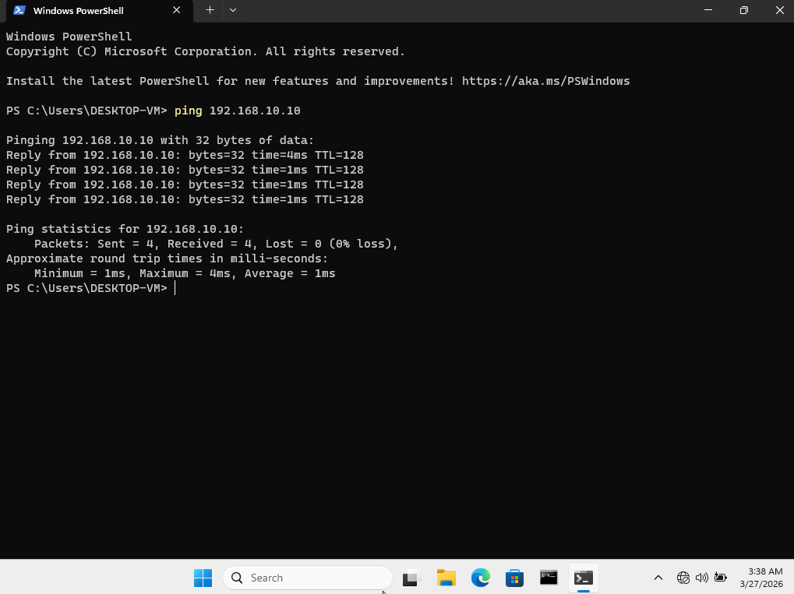

# Windows Server DHCP Lab

---

## 1. Objective
Configure a Windows Server DHCP server to dynamically assign IP addresses to client machines in a local network.

---

## 2. Lab Environment
- **Server OS**: Windows Server 2022  
- **Client OS**: Windows 11  
- **Virtualization Hypervisor**: VirtualBox

---

## 3. Network Design

- **Network**: 192.168.10.0/24  
- **DHCP Server IP**: 192.168.10.10  
- **DHCP Range**: 192.168.10.100 – 192.168.10.200  
- **Default Gateway**: 192.168.10.1  
- **DNS Server**: 8.8.8.8

---

##  4. Concept Overview

DHCP (Dynamic Host Configuration Protocol) automatically assigns IP addresses to devices in a network.

It works using the **DORA process**:
- Discover  
- Offer  
- Request  
- Acknowledge  

This allows devices to join the network without manual configuration.

---

## 5. Implementation

### Step 1: Set Static IP on Server
Configured the server with a static IP:

- IP: 192.168.10.10  
- Subnet: 255.255.255.0  
- Gateway: 192.168.10.1  
- DNS: 8.8.8.8  

---

### Step 2: Install DHCP Role
Used Server Manager to install the DHCP Server role.

---

### Step 3: Post Installation Configuration
Completed DHCP configuration and authorized the server.

---

### Step 4: Create DHCP Scope

Configured a new scope with:

- Start IP: 192.168.10.100  
- End IP: 192.168.10.200  
- Subnet Mask: 255.255.255.0  
- Default Gateway: 192.168.10.1  
- DNS Server: 8.8.8.8

Additional Notes:

- DHCP Reservation:

    1. Allows assigning a specific IP address to a device based on its MAC address.
    2. Useful for servers, printers, and important devices.

- Exclusion Range:

    1. Used to exclude specific IP addresses within the DHCP scope so they are not assigned to clients.

- Lease Duration

    1. Defines how long a client can use an assigned IP address before it must renew it.
    2. Short leases are used in dynamic environments, while longer leases are used in stable networks.

---

### Step 5: Activate Scope
Activated the DHCP scope to start assigning IP addresses.

---

### Step 6: Configure Client
Set client to obtain IP automatically and ran:
```
ipconfig /release
ipconfig /renew
```

---

## 6. Verification & Testing

- Client successfully received an IP address from the DHCP pool
- Default gateway and DNS were assigned correctly
- Connectivity verified using ping:
```
ping 192.168.10.10
```

---

## 7. Issues & Troubleshooting

| No. | Issue | Cause | Fix |
|------|------|------|------|
| 1 | Client did not receive IP| DHCP scope not activated or authorized | Activated & authorized the scope in DHCP Manager |
| 2 | Incorrect IP range assigned | Wrong scope configuration | Adjusted IP range to correct subnet |
| 3 | No network connectivity | Server not using static IP | Configured static IP properly |

---

## 8. Screenshots

Server Static IP Configuration:


DHCP Scope Configuration:


Scope Options (Gateway + DNS):


Client obtaining IP Address:


Ping test result:


---

## 9. Key Takeaways

 - DHCP requires a static IP on the server to function correctly
 - Scope activation and authorization is essential for IP assignment
 - Small misconfigurations can prevent DHCP from working
 - Understanding the DORA process helps in troubleshooting
 - Windows DHCP configuration is GUI based but still requires careful setup

---

## 10. Future Improvements

- Implement DHCP Reservation (assign fixed IP to specific devices using MAC address)
- Configure Exclusion Range to prevent certain IPs from being assigned
- Adjust Lease Duration (controls how long an IP is assigned to a client before renewal)
- Integrate DHCP with Active Directory

