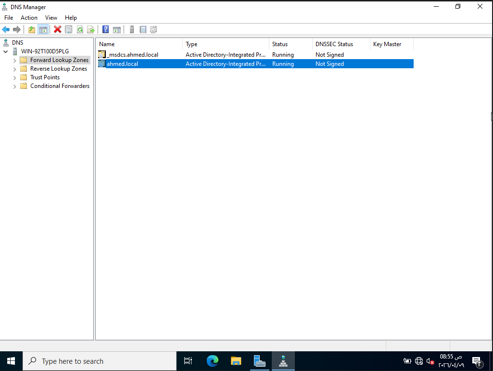
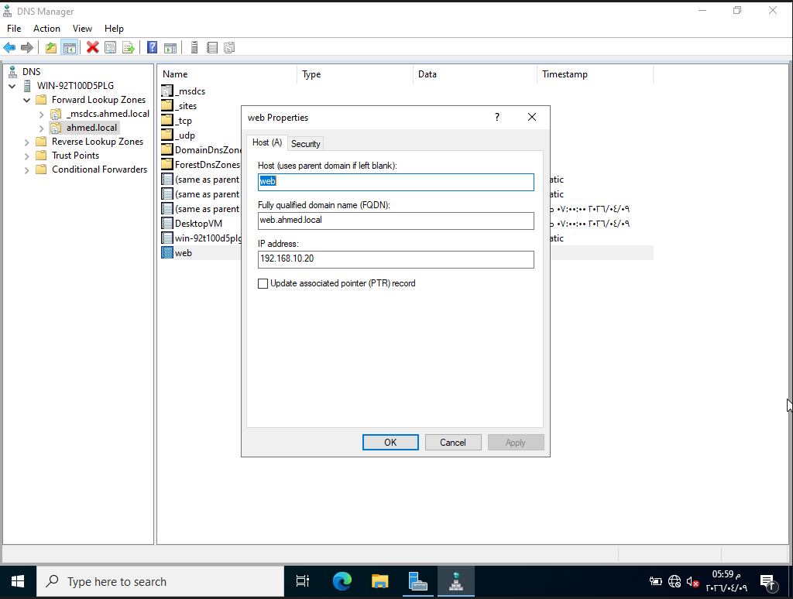
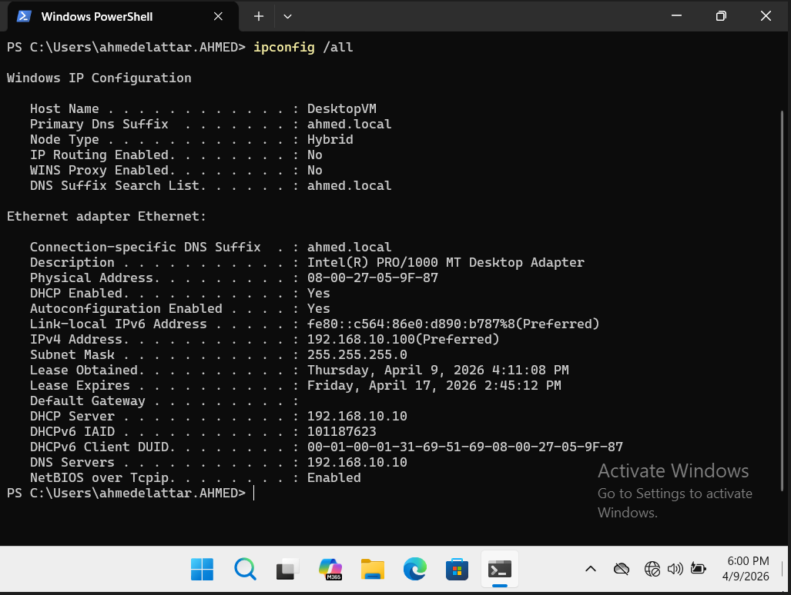
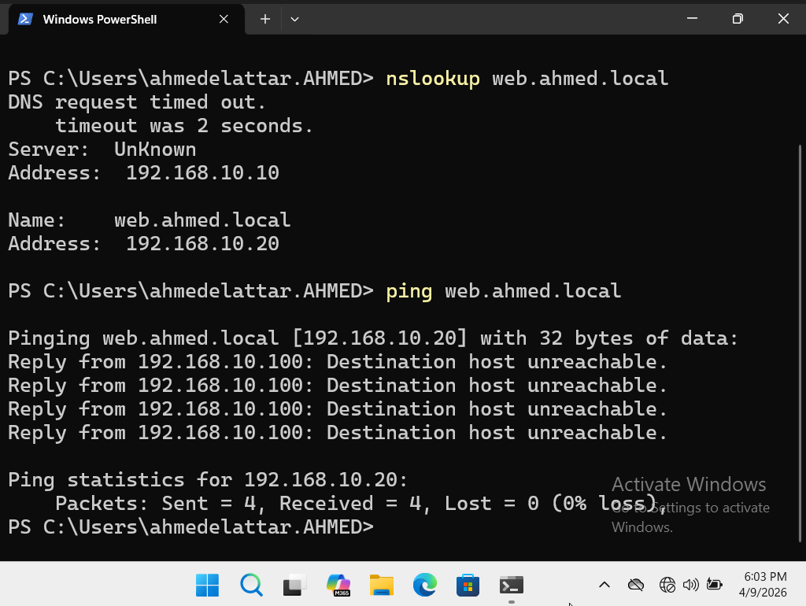

# DNS Configuration in Active Directory Lab

---

## 1. Objective
Configure and test DNS within an Active Directory environment to enable name resolution for domain resources.

---

## 2. Lab Environment

- Server OS: Windows Server 2022
- Client OS: Windows 11  
- Virtualization Hypervisor: VirtualBox 

---

## 3. Network Design

- Network: 192.168.10.0/24
- Domain: ahmed.local  
- Domain Controller / DNS Server: 192.168.10.10  
- Client: DHCP (receives IP + DNS automatically)

---

## 4. Concept Overview

In Active Directory environments, DNS is a critical service used to resolve domain names to IP addresses.

Active Directory relies heavily on DNS for:
- Locating domain controllers  
- Authenticating users  
- Accessing network resources  

Without DNS, Active Directory cannot function properly.

---

## 5. Implementation

### Step 1: Verify DNS Installation

- Open Server Manager  
- Navigate to Tools then DNS  
- Confirm DNS Manager is available  

---

### Step 2: Verify Forward Lookup Zone

- Go to: Forward Lookup Zones  
- Confirm domain exists:
  
  ```
    ahmed.local
  ```
---

### Step 3: Create DNS Record

- Right click on the zone → New Host (A Record)

Enter:
```
  Name: web  
  IP Address: 192.168.10.20  
```
Result:
```
  web.ahmed.local
```
---

### Step 4: Client Configuration

Client receives network configuration automatically via DHCP:
- IP Address  
- Subnet Mask  
- Default Gateway  
- DNS Server (192.168.10.10)  

---

### Step 5: Test DNS Resolution

Open Command Prompt on client:
```
  nslookup web.ahmed.local
```
Expected result:
```
  192.168.10.20
```
---

### Step 6: Test Connectivity
```
  ping web.ahmed.local
```
---

## 6. Verification & Testing

- DNS server successfully configured  
- A record created and resolved  
- Client receives DNS automatically via DHCP  
- Name resolution working correctly  

---

## 7. Issues & Troubleshooting

### Issue: DNS not resolving  
- Cause: Incorrect DNS server assigned  
- Fix: Verified DHCP provides correct DNS (192.168.10.10)  

---

### Issue: Cached incorrect results  
- Fix:
```
  ipconfig /flushdns  
```
---

### Issue: Record not found  
- Cause: Record not created or typo  
- Fix: Verified DNS records in DNS Manager  

---

## 8. Screenshots

Include:

DNS Manager with ahmed.local zone



A Record (web → 192.168.10.20)



Client IP configuration



nslookup & ping tests result



---

## 9. Key Takeaways

- DNS is essential for Active Directory functionality  
- Domain names rely on DNS for resolution  
- DHCP and DNS work together in real environments  
- Proper DNS configuration is critical for network services  

---

## 10. Future Improvements

- Join client machine to domain  
- Create multiple DNS records  
- Implement reverse lookup zones  
- Explore Group Policy management
